# SEL0337

## Prática 5
Para a prática 5 o código desenvolvido na prática 4 para acesso RFID foi utilizado.

### 💻 Dependências
Bibliotecas:
- [x] RPi.GPIO
- [x] gpiozero
- [x] time
- [x] mfrc522
- [x] colorzero
- [ ] serial
- [ ] ultralytics
- [ ] cv2
- [ ] picamera2

### 🚀 Funcionamento
O código foi feito para que o leitor RFID se inicie com o linux via systemD, a principio o código foi feito de forma a autorizar apenas uma RFID e funcionar contantemente até que a leitura dessa RFID específica seja realizada.
De forma geral é um código que faria parte de um sistema maior, como um aplicativo que só deve funcionar sobre autorização, sendo apenas uma prova de conceito.
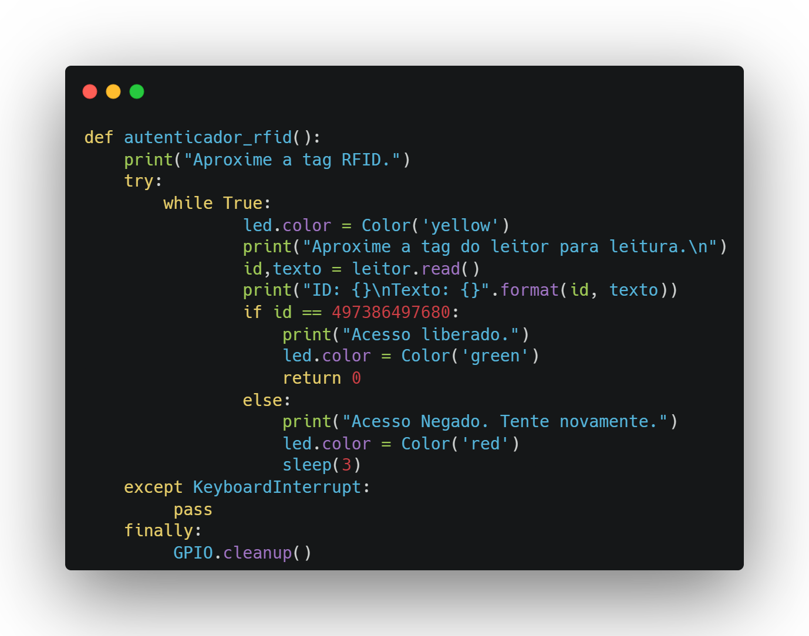
O programa contantemente aguarda a leitura de um tag RFID, indicado pelo LED aceso com cor amerela, após a leitura de uma tag é verificado se o ID da tag corresponde ao ID estabelecido no código. Caso a tag seja autorizada o programa aciona o LED com a luz verde e retorna 0, caso contrário o LED é acionado com luz vermelha e o programa volta para o loop principal após 3 segundos.
Por segurança, pois trata-se algo relacionado a inicialização do sistema, foi adicionado uma interrupção pelo teclado a fim de evitar qualquer tipo de erro não esperado na inicialização devido ao autenticador.

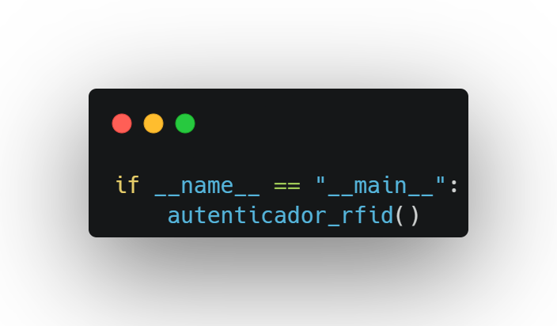
Por fim garante-se que o código só funcionará quando executador diretamente, parte vestigial do código feita para testar as funcionalidades do systemD que foi mantida por não afetar o funcionamento do código.

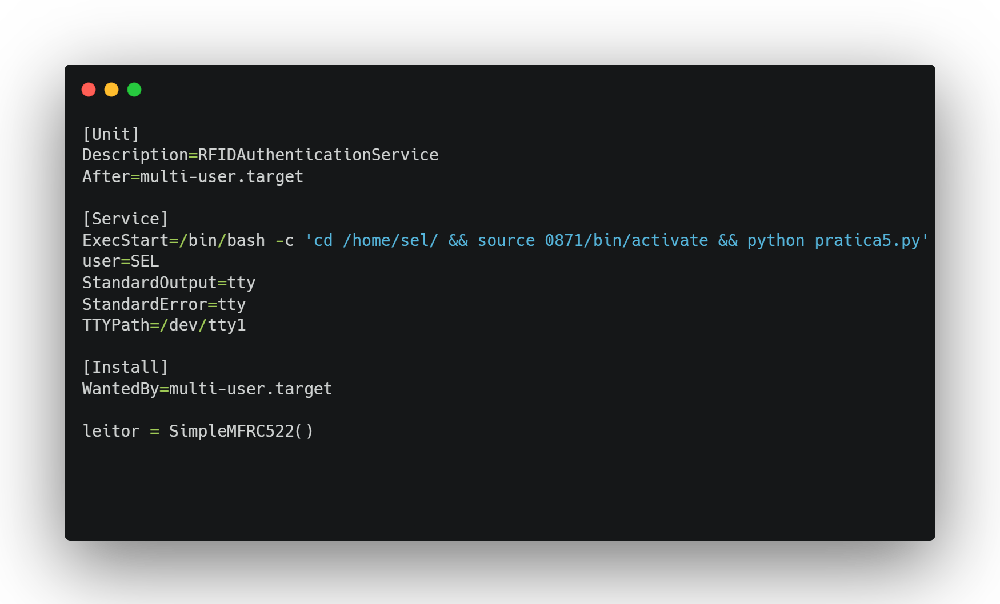
O .service feito para essa prática é bem simples e segue o padrão dos exemplos de aula, para utilizações práticas adionaria-se um ExecStop para executar o programa desejado após a autenticação.
Por motivos ainda não esclarecidos o programa não funciona na raspberry PI com o endereço do resposítorio, forçando que o código fosse colocado em /home/sel/ como indicado pelo .service.

## Prática Final
### 💻 Dependências
Bibliotecas:
Python:
- [ ] RPi.GPIO
- [ ] gpiozero
- [x] time
- [ ] mfrc522
- [ ] colorzero
- [x] serial
- [x] ultralytics
- [x] cv2
- [x] picamera2

C++ (Arduino IDE):
- [x] Wire
- [x] Adafruit_SSD1306
- [x] Adafruit_GFX
### 🔧 Montagem
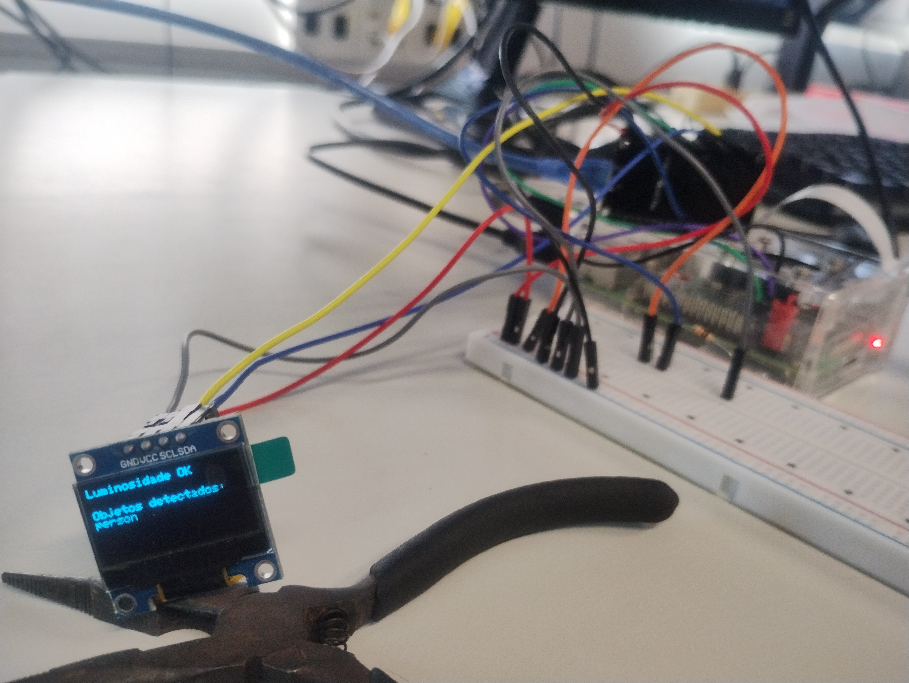
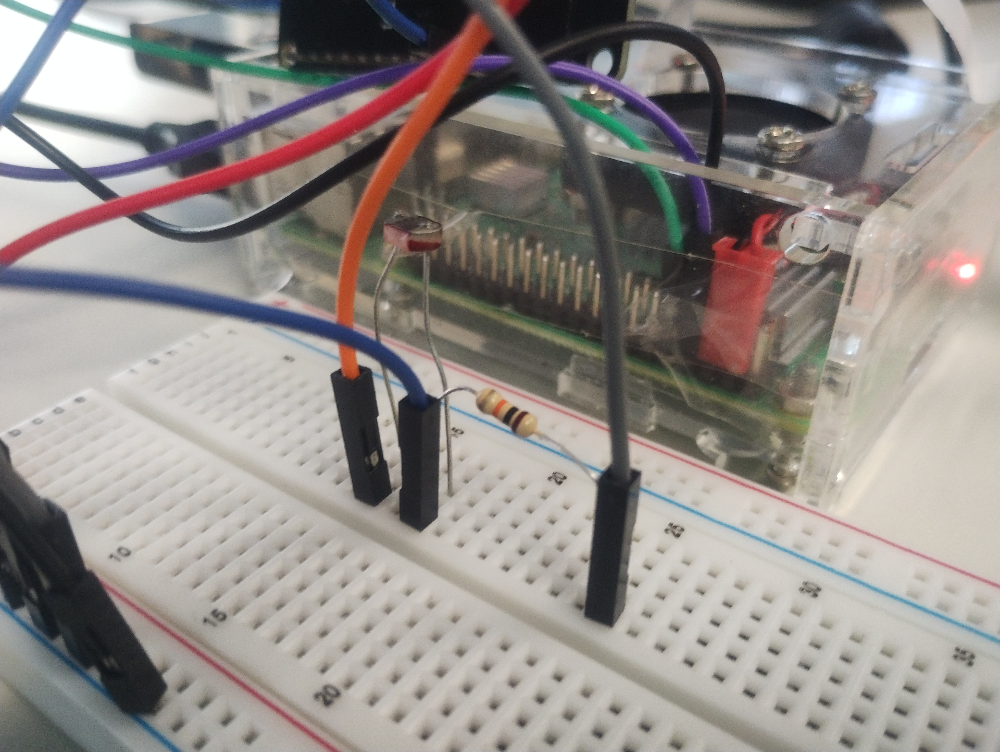
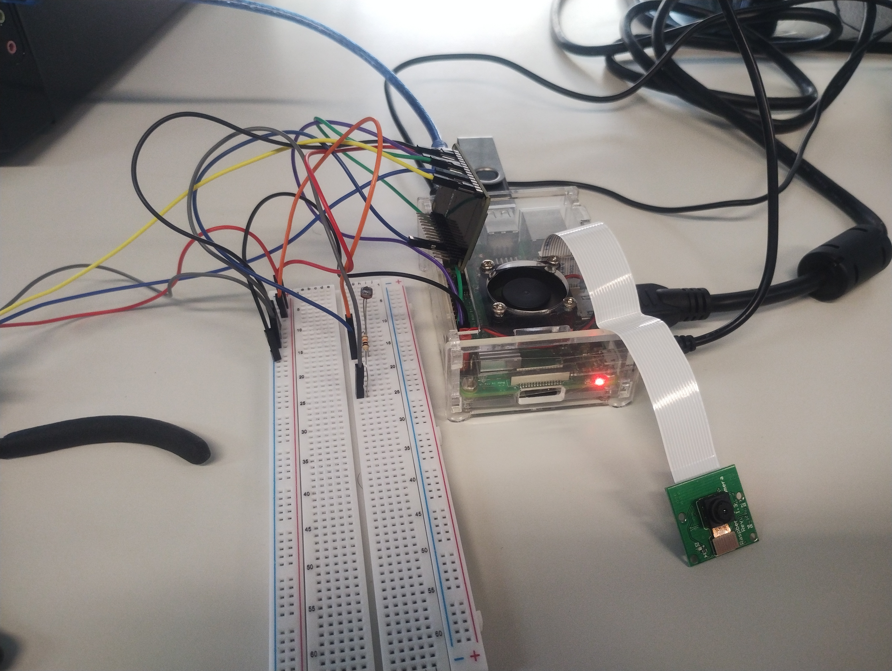

Para reproduzir os resultados no mesmo laboratório sugere-se procurar pela Picamera com a marcação indicada na figura abaixo, dentro da caixa estará uma Picamera funcional e um adaptador USP com um cartão SD bootable na raspberry pi que foi utilizado nos meus testes.

### 🚀 Funcionamento
O sistema foi feito para que a ESP32 controle o acionamento de um sistema de reconhecimento de objetos, utilizando uma placa Raspberry Pi como servidor para capturar e processar a imagem, um sensor de luminosidade indica se há condições luminosas suficientes para o funcionamento correto do sistema. Por fim um displey OLED indicará se a luminosidade está dentro dos requisitos e mostrará o resultado da classificação de imagem acionada.

Os códigos em python que rodam na raspberry pi são relativamente simples, temos o scrip tesponsável pela captura da imagem utilizando a biblioteca picamera2:
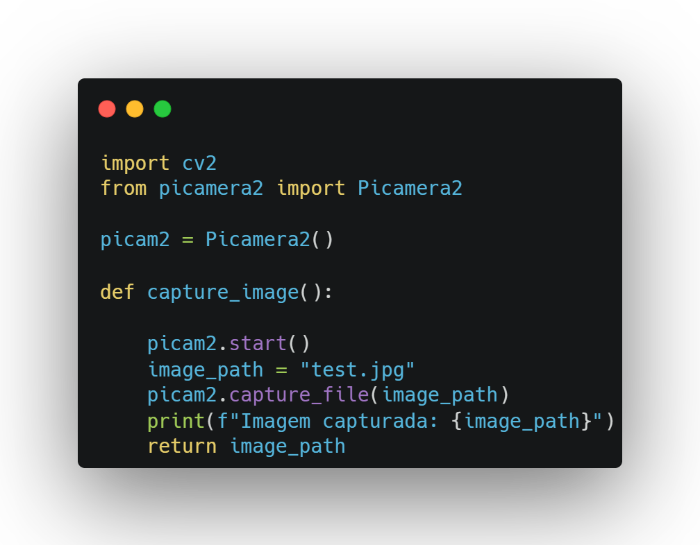
Outro código é responsável por aplicar o algoritmo de classificação YOLO, com diversas versões disponíveis para melhor precisão ou maior velocidade:
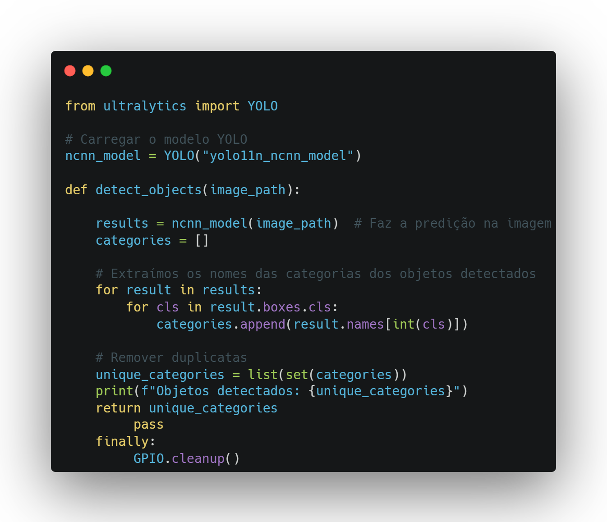
Por fim o código que de fato é executado durante o funcionamento do sistema, que espera a flag da ESP32 recebia via UART, chama o script de camera seguido do de classificação para por fim enviar os resultados da classificação via UART de volta para a ESP32:
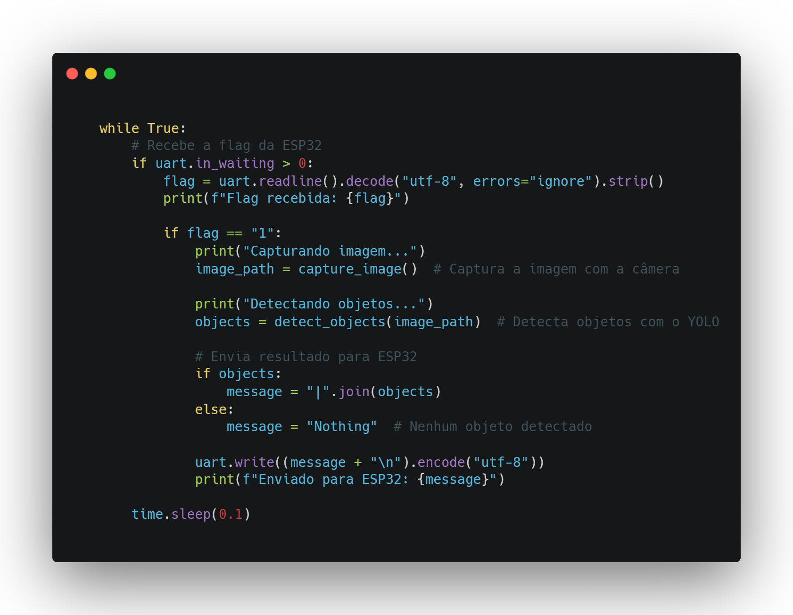

Para a placa ESP32 o script feito possui 2 tasks utilizando o freeRTOS, com cada uma fixa em um núcleo diferente.
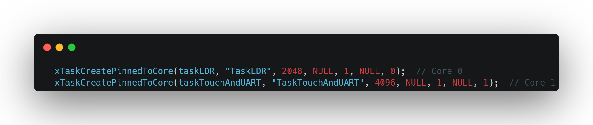
A primeira task cuida da leitura do ADC que monitora a luminosidade do ambiente via um LDR e apresenta o resultado no display:
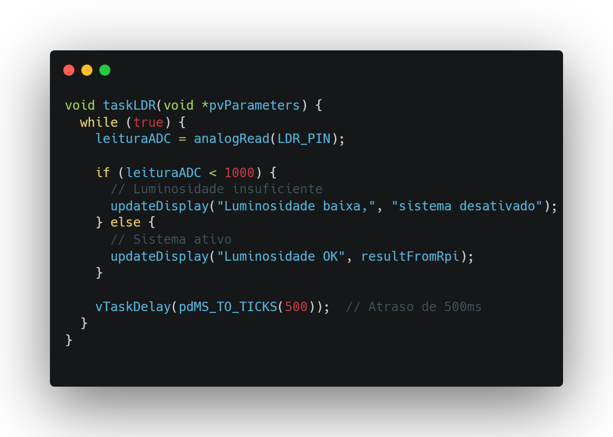
Por fim temos a task responsável pelo acionamento via botão touch e transmissão/recepção dos dados via UART, enviando a flag de acionamento para a raspberry pi e aguardando o resultado da classificação, imprimindo o resultado no display:
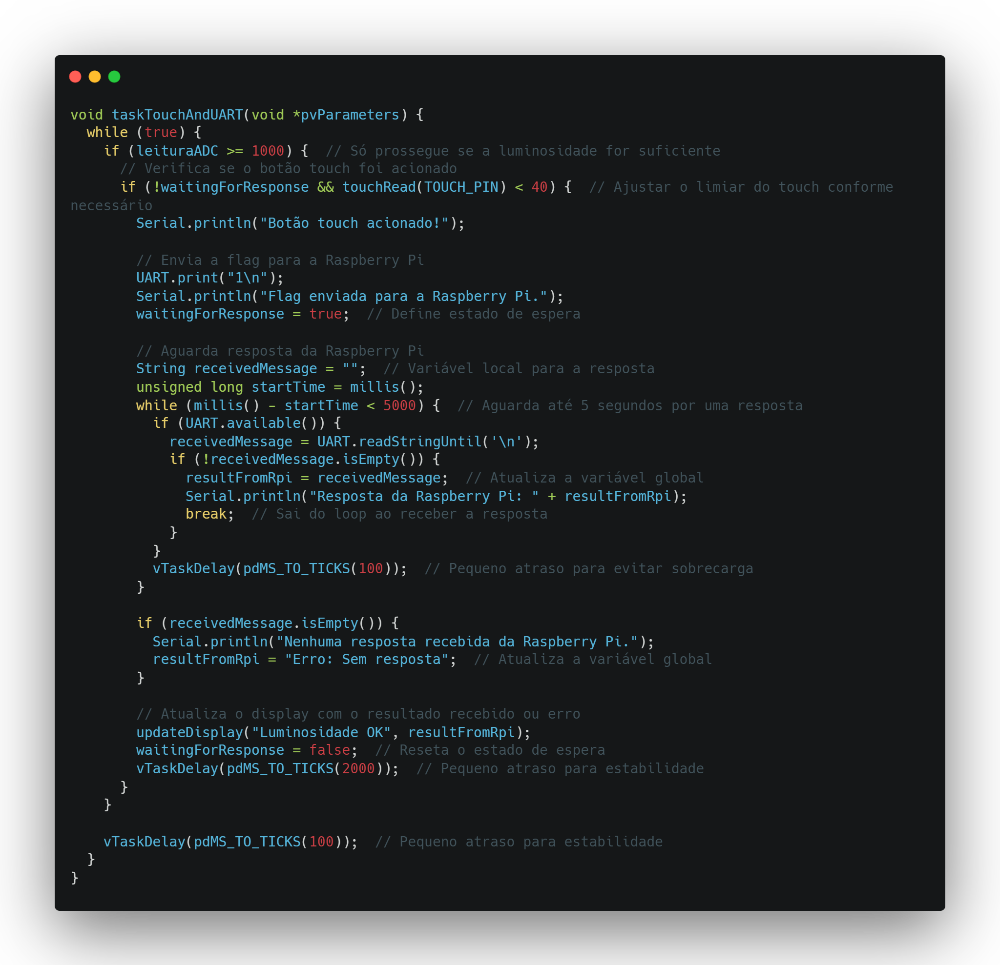
[Sistema em funcionamento (https://youtu.be/TTqWvQ29oNY):](https://youtu.be/TTqWvQ29oNY)

